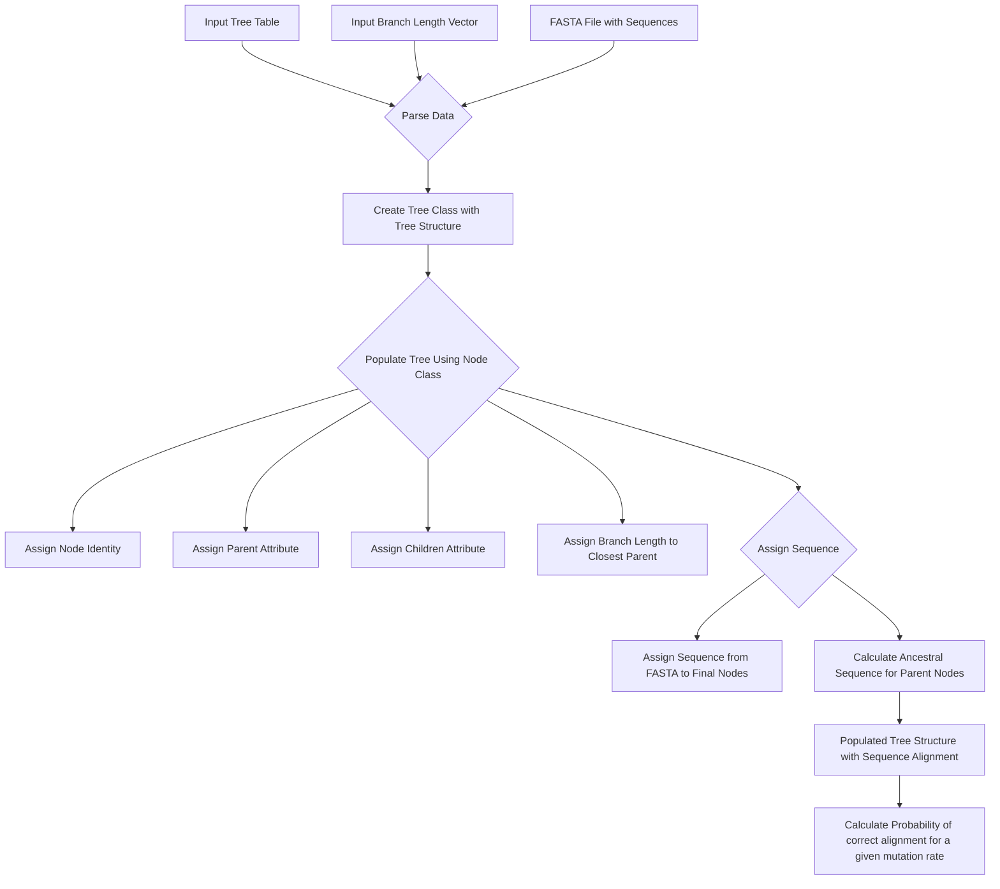

# PhyloCalc [WORK IN PROGRESS]

## Introduction
PhyloCalc is a custom Python module designed to calculate the probability of a phylogenetic tree, accounting for varying nucleotide substitution probabilities. Developed for the Advanced Python Programming Course in the University of Lausanne’s first-year Master of Molecular Life Sciences program, PhyloCalc operates independently of the Biopython library.

## Key Features
- **Phylogenetic Tree Probability Calculation**: PhyloCalc computes the likelihood of a phylogenetic tree based on given DNA sequences, tree structure, and branch lengths. It also predicts the most probable nucleotide mutation rates.
- **FASTA File Integration**: The module supports FASTA file input, allowing users to seamlessly incorporate their DNA sequence data. [WIP]
- **Tree Structure Parsing**: PhyloCalc can interpret tree structures in tabular format, facilitating compatibility with various tree representations.
- **Visualization**: PhyloCalc can generate visualizations of phylogenetic trees, providing a clearer view of evolutionary relationships. [WIP]

## Friday 09.11.2024 - Preliminary Step: Overview of the Project

## Monday 11.11.2024 - Code Versioning

The algorithm is located in phylocalc.py but can be accessed graphically by launching the phylocalcgui.py.

