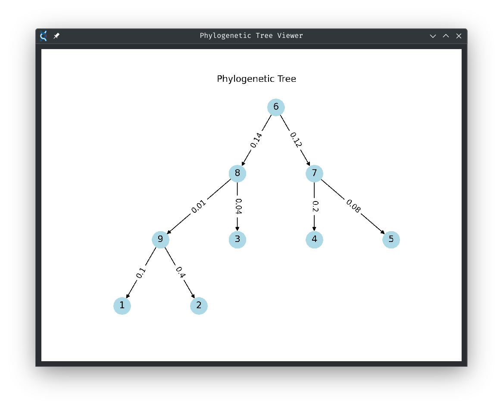

# PhyloCalc [WORK IN PROGRESS]

## Overview
PhyloCalc is a Python module tailored to calculate the probability of phylogenetic trees, considering diverse nucleotide substitution probabilities. This tool was developed as part of the Advanced Python Programming Course at the University of Lausanne’s first-year Master of Molecular Life Sciences program. Importantly, PhyloCalc is designed to function independently of the Biopython library, ensuring a custom-built solution for specific phylogenetic analyses.

---

## Key Features
- **Phylogenetic Tree Likelihood Computation**  
  PhyloCalc calculates the likelihood of a phylogenetic tree based on DNA sequences, tree structures, and branch lengths. ✅  
- **Flexible Tree Parsing**  
  Reads tree structures in tabular formats, enhancing compatibility with different data representations. ✅  
- **Visual Representation**  
  Generates clear and intuitive visualizations of phylogenetic trees, aiding in the interpretation of evolutionary relationships. ✅  

### Upcoming Enhancements
- **FASTA File Integration**  
  Allowing direct input of DNA sequences from FASTA files to streamline the workflow. [Work in Progress] 🤔

---

## How It Works

### Workflow Diagram


## Project Components

### Core Functionalities
1. **Tree Object Construction**  
   The core algorithm responsible for building the `Tree` object and calculating the log-likelihood is implemented in the `phylocalc.py` script.  
2. **Graphical Interface**  
   A user-friendly interface is provided via `phylocalcgui.py`. This script integrates all functionalities and allows users to interact with the module easily.  
3. **Tree Visualization**  
   Implemented in `tree_visualization.py`, the visualization functionality uses NetworkX to display the phylogenetic tree in a pop-up window (requires appropriate packages installed).  

---

## Installation and Setup

### Prerequisites
- Python 3.12 or higher
- Required packages:  
  ```bash
  pip install pyqt6 networkx numpy
  ```

### Get Started
1. **Clone the repository**
    ```bash
    git clone https://github.com/douhan-wicht/PhyloCalc
    cd PhyloCalc
    ```
2. **Run the GUI**
   ```bash
   python phylocalcgui.py
   ```

---

## Screenshots



